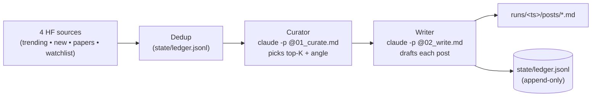

<div align="center">

# HFSonar

**Watch HuggingFace. Let Claude pick what's worth talking about. Get drafts on disk, ready to publish.**

[](https://www.python.org)
[](https://docs.claude.com/en/docs/claude-code)
[](#tests)
[](#whats-intentionally-not-here-yet)

</div>

HFSonar polls HuggingFace on a schedule, asks the `claude` CLI which signals are worth posting about, then asks it to draft each one. Drafts land in a versioned local queue with full provenance — you read, decide, and publish.

A thin Python orchestrator owns the loop, dedup, and on-disk artifacts. Every per-step decision (curation, drafting) is a single `claude -p @file` subprocess call — the LLM is the backbone, the orchestrator is the spine.

---

## How a cycle runs



Every prompt sent to Claude is saved verbatim under `runs/<ts>/prompts/`, so a bad post can be debugged by replaying the exact same prompt.

---

## Quick start

```bash
git clone https://github.com/yyifan-Onyen/HFSonar.git && cd HFSonar
python3.13 -m venv .venv && .venv/bin/pip install -r requirements.txt

.venv/bin/python main.py poll --fake-llm   # dry run, zero tokens
.venv/bin/python main.py poll              # real Claude (~$0.30–$1 per cycle)
.venv/bin/python main.py loop --interval 3600   # forever, hourly
.venv/bin/python main.py list              # what's been run
```

Requires **Python 3.11+** (uses stdlib `tomllib`) and the [`claude` CLI](https://docs.claude.com/en/docs/claude-code) on PATH.

---

## What gets monitored

| Source           | Where it comes from                           | Bypasses `min_likes`? |
| ---------------- | --------------------------------------------- | :--------------------:|
| Trending models  | `list_models(sort="trendingScore")`           |                       |
| New models       | `list_models(sort="createdAt")`               |                       |
| Daily Papers     | `huggingface.co/api/daily_papers`             | yes                   |
| Watchlist orgs   | `list_models(author=org, sort="createdAt")`   | yes                   |

Default watchlist (edit `config.toml`): `meta-llama`, `mistralai`, `Qwen`, `deepseek-ai`, `google`, `microsoft`, `stabilityai`, `black-forest-labs`, `nvidia`, `anthropic`.

---

## What gets produced

```
runs/20260508T222739_145839Z/
├── prompts/
│   ├── 01_curate.prompt.md          # exact text sent to claude
│   ├── 02_write_01.prompt.md
│   ├── 02_write_02.prompt.md
│   └── 02_write_03.prompt.md
├── posts/
│   ├── 01__trending_models__deepseek-ai__DeepSeek-V4-Pro.md
│   ├── 02__daily_papers__2605.06627.md
│   └── 03__watchlist__Qwen__Qwen3-Next-7B.md
└── run_manifest.json                # candidates, curator output, post paths
```

Every post comes with structured frontmatter — provenance is preserved, search and indexing are trivial:

```markdown
---
source: trending_models
event_id: meta-llama/Llama-3-8B
url: https://huggingface.co/meta-llama/Llama-3-8B
author: meta-llama
likes: 2453
created_at: 2026-05-03T00:33:24+00:00
angle: 'first Apache-2.0 70B model to clear MMLU 80'
generated_at: 2026-05-08T22:27:40+00:00
---

# Hook line — the concrete novelty

Body paragraph or bullets, written by the Claude Writer using the
project-local style guides in .claude/skills/guides/.

https://huggingface.co/meta-llama/Llama-3-8B
```

---

## How Claude is invoked

The pattern, kept to the fewest moving parts:

```bash
claude -p @runs/<ts>/prompts/01_curate.prompt.md --output-format json
```

`-p @file` lets the CLI read the prompt from disk (cache-friendly, replayable). `--output-format json` returns one envelope with `result` plus token/cost metadata, which the operator parses cleanly. No tool use, no streaming, no permission bypass — Claude only emits text.

Want to swap to Codex or another LLM CLI? Add a class implementing the `Operator` protocol in [`src/operator.py`](src/operator.py). Source adapters, prompts, ledger, orchestrator are unchanged.

---

## Layout

```
HFSonar/
├── main.py                       # CLI: poll | loop | list
├── config.toml                   # tunables + watchlist orgs
├── requirements.txt
├── src/
│   ├── events.py                 # Event dataclass + dedup_key
│   ├── ledger.py                 # JSONL ledger, set-backed
│   ├── operator.py               # ClaudeOperator + FakeOperator
│   ├── orchestrator.py           # the cycle
│   ├── prompts/
│   │   ├── 01_curate.md
│   │   └── 02_write_post.md
│   └── sources/
│       ├── _hf_common.py
│       ├── trending_models.py
│       ├── new_models.py
│       ├── daily_papers.py
│       └── watchlist.py
├── .claude/skills/guides/        # auto-loaded by claude in this repo
│   ├── ai-news-tone.md
│   ├── post-formatting.md
│   └── hf-context.md
├── tests/                        # 11 token-free pytest tests
├── state/ledger.jsonl            # gitignored — persists across runs
└── runs/<ts>/                    # gitignored — one dir per cycle
```

---

## Configuration

`config.toml` (override per machine via `config.local.toml`):

| Section       | Key                  | Default                      | Meaning                                          |
| ------------- | -------------------- | ---------------------------- | ------------------------------------------------ |
| `[poll]`      | `trending_limit`     | `20`                         | candidates pulled from trending per cycle        |
| `[poll]`      | `new_models_limit`   | `30`                         | candidates pulled from newest per cycle          |
| `[poll]`      | `daily_papers_limit` | `15`                         | candidates pulled from daily papers per cycle    |
| `[poll]`      | `watchlist_limit`    | `3`                          | newest models pulled **per org**                 |
| `[curation]`  | `top_k`              | `5`                          | max posts the curator may keep                   |
| `[curation]`  | `min_likes`          | `5`                          | floor for trending/new (papers + watchlist skip) |
| `[watchlist]` | `orgs`               | 10 labs                      | who to track                                     |
| `[claude]`    | `binary`             | `"claude"`                   | CLI on PATH                                      |
| `[claude]`    | `timeout`            | `180`                        | per-call seconds                                 |
| `[claude]`    | `model`              | `""` (use Claude Code default) | override per cycle                              |

---

## Decisions locked in

Each one is a knob you can flip — or rip out — when it hurts. Listed so you know what the defaults assume.

- **Subprocess CLI, not the SDK.** `subprocess.run(["claude", "-p", "@file", "--output-format", "json"])`. Zero new auth surface; uses your existing Claude Code login and billing.
- **Two roles, two prompts.** Curator (JSON) and Writer (markdown). Splitting them keeps prompts small and caps the writer-call count per cycle to `top_k`.
- **Run dir is the source of truth.** Re-run any failing post with `claude -p @runs/<ts>/prompts/02_write_NN.prompt.md`.
- **JSONL ledger, not SQLite.** `git diff`-able, `tail -f`-able, dirt simple.
- **Local dry-run queue, no publisher.** Adding a Discord webhook / X / Telegram client is one new module behind a `Publisher` interface. Out of scope for v1.
- **`min_likes=5` floor + watchlist/papers bypass.** Stops 30 spam re-uploads from drowning the curator, but never hides a tracked-org release.
- **Polling cadence default 1h.** Daily Papers refreshes once a day; trending and new releases drift hourly. Tighter is wasteful.

---

## Tests

```bash
.venv/bin/pytest -q
# .........                                                       [100%]
# 11 passed in 0.05s
```

| File                              | Covers                                                              |
| --------------------------------- | ------------------------------------------------------------------- |
| `test_ledger.py`                  | round-trip, idempotency, `filter_unseen`                            |
| `test_events.py`                  | dedup key, dict round-trip, unknown-key tolerance                   |
| `test_curator_parse.py`           | plain JSON, fenced JSON, JSON-in-prose, garbage input               |
| `test_orchestrator_fake.py`       | end-to-end cycle with FakeOperator + stub sources, dedup on round 2 |

---

## What's intentionally **not** here yet

- **No publisher.** Drafts land on disk only. Adding one = one new module.
- **No web UI / dashboard.** HFSonar's surface is the filesystem and `list`.
- **No image / video preview generation** for vision-model releases.
- **No multi-language drafting.** English-only writer prompt for now.
- **No reviewer-agent gate** for auto-publishing. Wire this when a real publisher arrives.

Each is one module + one config flag away.

---

## Credits

- [HuggingFace Hub](https://huggingface.co) — the signal we listen to
- [Claude Code](https://docs.claude.com/en/docs/claude-code) — the writer
