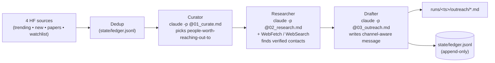

<div align="center">

# 📡 HFSonar

**Watch HuggingFace. Find the people behind interesting work. Get personalized outreach drafts on disk.**

[](https://www.python.org)
[](https://docs.claude.com/en/docs/claude-code)
[](#-tests)
[](#-whats-intentionally-not-here-yet)

</div>

HFSonar is a **networking agent**. It polls HuggingFace on a schedule, asks the `claude` CLI which signals are worth reaching out about, **researches the people behind those signals** (corresponding authors, their HF / GitHub / Twitter / website / email), and drafts a short, specific cold-outreach message for each one. Drafts land in a versioned local queue with full provenance — you read, decide, and send.

It's not a social-media autoposter. It's a *"find researchers whose work I'd love to discuss, draft the connect letter for me, let me hit send"* tool.

---

## 🔭 Overview

Every cycle does 4 things:

1. **Fetch** fresh signals from four feeds — **trending models**, **brand-new releases**, the **Daily Papers** stream, and a **watchlist of orgs**.
2. **Curate** with Claude — pick the few signals where reaching out to the *people behind them* is genuinely worth it (skip mirrors, quantizations, anonymous re-uploads).
3. **Research authors** with Claude + WebFetch/WebSearch — find the corresponding author / model owner and any public contact channels (email, Twitter, GitHub, website). **Never fabricates contact info.**
4. **Draft outreach** with Claude — write a short, specific, peer-to-peer message for the highest-confidence channel, with placeholders for *your* name and background. You sign and send.

A thin Python orchestrator owns the loop, dedup, and on-disk artifacts. Each per-step decision is a single `claude -p @file` subprocess call — the LLM is the backbone, the orchestrator is the spine.

---

## ✨ Highlights

- 🧠 **Claude Code as the backbone** — no SDK, no new auth; piggybacks on your existing Claude Code login.
- 📡 **Four HuggingFace feeds in one cycle** — trending, new releases, Daily Papers, watchlist orgs.
- 🕵️ **Auto author research** — Claude fetches the HF profile, arXiv page, GitHub, personal site to surface verified contact handles.
- ✉️ **Channel-aware drafting** — email if email is found, Twitter DM if only a handle, GitHub comment if only a repo profile.
- 🚫 **Never fabricates** — no fake `firstname@university.edu` guesses; missing email stays missing, with a note explaining why.
- 🗂️ **Never drafts the same person twice** — JSONL ledger persists across runs.
- 🔁 **Every prompt is replayable** — re-feed any saved prompt into `claude` to debug a bad draft.
- 🧪 **Token-free dev mode** — `--fake-llm` runs the full 3-stage pipeline with zero API spend.
- 📚 **Ships with outreach skills** — peer-to-peer cold-outreach voice + format rules + HF context, auto-loaded by Claude in this repo.
- 🔐 **No external API surface** — drafts stay on disk until you act. No webhooks, no SMTP, no surprises.

---

## 💡 Why HFSonar

The HuggingFace firehose is too loud to follow by hand. Hundreds of new models per day. A fresh batch of Daily Papers every morning. Your watched orgs ship without warning. The most interesting work — the kind where you'd actually *learn something* by talking to the author — is buried under 50 quantization mirrors.

By the time you scroll the timeline, find the one paper worth reading, dig up the corresponding author, look up their website, write a tactful "hi, loved your work" email — half an hour is gone. So you don't do it.

HFSonar runs while you sleep. Each morning you open `runs/<latest>/outreach/` and get 3–5 personalized drafts:

- *who* to reach out to (with verified handles, not guesses)
- *why now* (the specific hook from their paper / model)
- *what to say* (a short, peer-to-peer message you'd be willing to send)

You spend a minute per draft deciding **send / kill / edit**. The judgment call (and the actual send) stays with you. The discovery and the first draft don't have to.

---

## 🔄 How a cycle runs



Every prompt is saved verbatim under `runs/<ts>/prompts/`. A bad draft can always be debugged by replaying the exact same prompt.

---

## 🚀 Quick start

```bash
git clone https://github.com/yyifan-Onyen/HFSonar.git && cd HFSonar
python3.13 -m venv .venv && .venv/bin/pip install -r requirements.txt

.venv/bin/python main.py poll --fake-llm   # dry run, zero tokens
.venv/bin/python main.py poll              # real Claude (~$0.50–$2 per cycle, varies by author research depth)
.venv/bin/python main.py loop --interval 3600   # forever, hourly
.venv/bin/python main.py list              # what's been run
```

Requires **Python 3.11+** (uses stdlib `tomllib`) and the [`claude` CLI](https://docs.claude.com/en/docs/claude-code) on PATH.

---

## 👀 What gets monitored

| Source           | Where it comes from                           | Bypasses `min_likes`? |
| ---------------- | --------------------------------------------- | :--------------------:|
| Trending models  | `list_models(sort="trendingScore")`           |                       |
| New models       | `list_models(sort="createdAt")`               |                       |
| Daily Papers     | `huggingface.co/api/daily_papers`             | yes                   |
| Watchlist orgs   | `list_models(author=org, sort="createdAt")`   | yes                   |

Default watchlist (edit `config.toml`): `meta-llama`, `mistralai`, `Qwen`, `deepseek-ai`, `google`, `microsoft`, `stabilityai`, `black-forest-labs`, `nvidia`, `anthropic`.

---

## 📦 What gets produced

```
runs/20260509T023827_714106Z/
├── prompts/
│   ├── 01_curate.prompt.md             # exact text sent to claude
│   ├── 02_research_01.prompt.md
│   ├── 02_research_02.prompt.md
│   ├── 02_research_03.prompt.md
│   ├── 03_outreach_01.prompt.md
│   ├── 03_outreach_02.prompt.md
│   └── 03_outreach_03.prompt.md
├── outreach/
│   ├── 01__daily_papers__2605.06627.md
│   ├── 02__watchlist__Qwen__Qwen3-Next-7B.md
│   └── 03__trending_models__author__model.md
└── run_manifest.json                   # candidates, curator output, research summary, draft paths
```

Every draft has structured JSON frontmatter — provenance is preserved, search and indexing are trivial:

```yaml
---
{
  "source": "daily_papers",
  "event_id": "2605.06627",
  "event_url": "https://huggingface.co/papers/2605.06627",
  "event_title": "Adaptive RoPE schedules for long-context retraining",
  "angle": "Specific question about how the schedule was tuned",
  "primary_author": {
    "name": "Alice Researcher",
    "role": "corresponding",
    "affiliation": "MIT CSAIL",
    "email": "alice@csail.mit.edu",
    "twitter": "@alice_ml",
    "github": "alice",
    "website": "alice.dev",
    "huggingface": "https://huggingface.co/alice",
    "confidence": "high"
  },
  "coauthors": [...],
  "research_notes": "Email from arXiv corresponding-author line; twitter from HF profile; github cross-checked.",
  "generated_at": "2026-05-09T02:38:29+00:00"
}
---

**Channel:** email

**To:** Alice Researcher <alice@csail.mit.edu>

**Subject:** Question on the RoPE schedule from your long-context paper

---

I read your paper on adaptive RoPE schedules — the way you anneal the
schedule by curriculum was the part that surprised me most, since most
papers I've seen use a fixed schedule and rely on data filtering.

I'm <your background> and I've been working on <one sentence about your
project>. I'm curious whether you considered tying the schedule to the
loss curve directly, or whether you tried that and it didn't work.

If you ever have a minute to share what didn't work, I'd love to hear.

Best,
<your name>

## Alternative channels

- twitter: @alice_ml — active there, posts about RL & long-context
- github: alice — has a repo "rope-experiments" with related code
```

---

## 🧠 How Claude is invoked

Three subprocess calls per chosen item:

```bash
claude -p @runs/<ts>/prompts/01_curate.prompt.md     --output-format json
claude -p @runs/<ts>/prompts/02_research_NN.prompt.md --output-format json --allowedTools WebFetch,WebSearch
claude -p @runs/<ts>/prompts/03_outreach_NN.prompt.md --output-format json
```

The research stage is the only one that gets web tools enabled, and only the **read-only** tools — no shell, no edits. Everything else is plain text in / text out.

Want to swap to Codex or another LLM CLI? Implement the `Operator` protocol in [`src/operator.py`](src/operator.py). Sources, prompts, ledger, orchestrator are unchanged.

---

## 📁 Layout

```
HFSonar/
├── main.py                       # CLI: poll | loop | list
├── config.toml                   # tunables + watchlist orgs
├── requirements.txt
├── src/
│   ├── events.py                 # Event dataclass + dedup_key
│   ├── ledger.py                 # JSONL ledger, set-backed
│   ├── operator.py               # ClaudeOperator + FakeOperator (with tools= knob)
│   ├── orchestrator.py           # the 3-stage cycle
│   ├── prompts/
│   │   ├── 01_curate.md
│   │   ├── 02_research_author.md
│   │   └── 03_draft_outreach.md
│   └── sources/
│       ├── _hf_common.py
│       ├── trending_models.py
│       ├── new_models.py
│       ├── daily_papers.py
│       └── watchlist.py
├── .claude/skills/guides/        # auto-loaded by claude in this repo
│   ├── cold-outreach-tone.md
│   ├── outreach-format.md
│   └── hf-context.md
├── tests/                        # 13 token-free pytest tests
├── state/ledger.jsonl            # gitignored — persists across runs
└── runs/<ts>/                    # gitignored — one dir per cycle
```

---

## ⚙️ Configuration

`config.toml` (override per machine via `config.local.toml`):

| Section       | Key                  | Default                      | Meaning                                          |
| ------------- | -------------------- | ---------------------------- | ------------------------------------------------ |
| `[poll]`      | `trending_limit`     | `20`                         | candidates pulled from trending per cycle        |
| `[poll]`      | `new_models_limit`   | `30`                         | candidates pulled from newest per cycle          |
| `[poll]`      | `daily_papers_limit` | `15`                         | candidates pulled from daily papers per cycle    |
| `[poll]`      | `watchlist_limit`    | `3`                          | newest models pulled **per org**                 |
| `[curation]`  | `top_k`              | `5`                          | max outreach drafts the curator may keep         |
| `[curation]`  | `min_likes`          | `5`                          | floor for trending/new (papers + watchlist skip) |
| `[watchlist]` | `orgs`               | 10 labs                      | who to track                                     |
| `[claude]`    | `binary`             | `"claude"`                   | CLI on PATH                                      |
| `[claude]`    | `timeout`            | `180`                        | per-call seconds                                 |
| `[claude]`    | `model`              | `""` (use Claude Code default) | override per cycle                              |

---

## 🔒 Decisions locked in

- **Subprocess CLI, not the SDK.** `subprocess.run(["claude", "-p", "@file", "--output-format", "json"])`. Zero new auth surface; uses your existing Claude Code login and billing.
- **3 Claude roles, 3 prompts.** Curator (JSON), Researcher (JSON, with WebFetch/WebSearch), Drafter (markdown). Splitting them means the research call only burns web fetches for items the curator already kept.
- **Run dir is the source of truth.** Re-run any failing draft with `claude -p @runs/<ts>/prompts/03_outreach_NN.prompt.md`.
- **JSONL ledger, not SQLite.** `git diff`-able, `tail -f`-able, dirt simple.
- **Local dry-run queue, no sender.** Adding an SMTP / Twitter / LinkedIn sender is one new module. Out of scope for v1 — automatic *sending* of cold-outreach is borderline spam and not what this tool exists for.
- **Researcher must cite sources for every contact field.** Hardcoded in `02_research_author.md`. No fabricated emails.
- **Polling cadence default 1h.** Daily Papers refreshes once a day; trending and new releases drift hourly.

---

## 🧪 Tests

```bash
.venv/bin/pytest -q
# .............                                                       [100%]
# 13 passed in 0.19s
```

| File                              | Covers                                                                              |
| --------------------------------- | ----------------------------------------------------------------------------------- |
| `test_ledger.py`                  | round-trip, idempotency, `filter_unseen`                                            |
| `test_events.py`                  | dedup key, dict round-trip, unknown-key tolerance                                   |
| `test_curator_parse.py`           | curator JSON variants + research JSON normalization (defaults filled)               |
| `test_orchestrator_fake.py`       | full 3-stage e2e with FakeOperator + stub sources, prompt count, dedup on round 2   |

---

## 🚧 What's intentionally **not** here yet

- **No sender.** Drafts land on disk only. Auto-sending cold outreach is a spam vector, not a feature.
- **No web UI / dashboard.** HFSonar's surface is the filesystem and `list`.
- **No PDF parsing.** The researcher fetches arXiv abstract pages but doesn't extract the corresponding-author email from the PDF first page (would need a PDF parser). Coming when it pays for itself.
- **No multi-language drafting.** English-only outreach voice for now.
- **No CRM integration.** No "did Alice reply yet?" tracking. Plug Notion / Linear / Airtable downstream of `runs/` if you need it.

Each is one module + one config flag away.

---

## 🙏 Credits

- [HuggingFace Hub](https://huggingface.co) — the signal we listen to
- [Claude Code](https://docs.claude.com/en/docs/claude-code) — the brain
